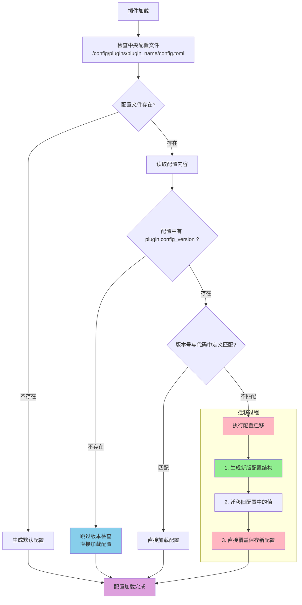

# ⚙️ 插件配置完整指南

本文档将全面指导你如何为你的插件**定义配置**和在组件中**访问配置**，帮助你构建一个健壮、规范且自带文档的配置系统。

> **🚨 重要原则：任何时候都不要手动创建配置文件！**
>
> 配置文件由系统根据你在代码中定义的 `config_schema` 自动生成在 `config/plugins/你的插件名/` 目录下。手动创建或修改此文件的结构可能会破坏自动化流程，导致配置不一致、版本迁移失败等问题。

## 配置版本管理

### 🎯 版本管理概述

插件系统提供了强大的**配置版本管理机制**。当你的插件更新、配置结构发生变化时，该机制能够自动处理用户现有配置文件的迁移，确保配置结构始终与代码定义保持同步。

### 🔄 配置版本管理工作流程

<details>
<summary>点击查看工作流程图</summary>



</details>

### 📊 版本管理策略

#### 1. 配置版本定义 (关键步骤)

为了启用版本管理，你**必须**在 `config_schema` 的 `plugin` 节中定义 `config_version` 字段。

```python
config_schema = {
    "plugin": {
        "enabled": ConfigField(type=bool, default=False, description="是否启用插件"),
        "config_version": ConfigField(type=str, default="1.2.0", description="配置文件版本，请勿手动修改"),
    },
    # 其他配置...
}
```


- **字段要求**: 必须是 `plugin` 节下的 `config_version`。
- **版本号规范**: 建议使用字符串形式的语义化版本号 (例如: `"1.0.0"`, `"1.1.0"`)。

#### 2. 版本检查行为

- **无版本信息** (配置文件中不存在 `[plugin].config_version`)
  - 系统会**跳过版本检查**，直接加载现有配置。
  - 日志显示：`用户配置文件无版本信息，跳过版本检查`

- **有版本信息** (存在 `[plugin].config_version` 字段)
  - 系统会比较用户配置文件中的版本号与代码 `config_schema` 中定义的默认版本号。
  - **版本不匹配**：自动执行配置迁移。
  - **版本匹配**：直接加载配置。

#### 3. 配置迁移过程

当检测到版本不匹配时，系统会自动执行以下操作：

1.  **生成新配置结构** - 根据最新的 `config_schema` 在内存中生成一份全新的配置。
2.  **迁移配置值** - 将用户旧配置文件中的值逐一迁移到新结构中。已存在的字段会保留用户设置的值，新添加的字段会使用 `config_schema` 中定义的默认值。
3.  **更新版本号** - `config_version` 字段会自动更新为代码中定义的最新版本。
4.  **移除项警告** - 如果旧配置中的某个字段在新 `config_schema` 中不存在了，系统会在日志中打印警告。
5.  **保存配置文件** - **直接覆盖**原有的用户配置文件，**不会创建备份文件**。

### ⚠️ 重要注意事项

- **修改 Schema 时必须更新版本号**: 当你修改 `config_schema`（增、删、改任何字段）时，**必须同步提升** `config_version` 的版本号，否则迁移不会被触发。
- **迁移无备份**: 配置迁移是**破坏性操作**。系统会直接覆盖用户原有的配置文件，且不会自动备份。请在发布新版本前提醒用户手动备份。
- **失败安全**: 如果迁移过程中出现严重错误，程序会中断，用户的原始配置文件将保持不变。

---

## 配置定义

配置的定义在你的插件主类（继承自 `BasePlugin`）中通过以下几个类属性完成：

1.  `config_file_name`: 配置文件名，例如 `"config.toml"`。
2.  `config_section_descriptions`: 一个字典，用于为配置文件的每个 `[section]` 添加注释。
3.  `config_schema`: 核心部分，一个嵌套字典，用于定义每个区段下的具体配置项。

### `ConfigField`：配置项的基石

每个配置项都通过一个 `ConfigField` 对象来定义。

```python
from src.plugin_system.base.config_types import ConfigField

# ConfigField 定义
class ConfigField:
    type: type          # 字段类型 (str, int, float, bool, list)
    default: Any        # 默认值
    description: str    # 字段描述 (将作为注释生成到配置文件中)
    example: Optional[str] = None       # 示例值 (可选)
    required: bool = False              # 是否必需 (可选, 主要用于文档提示)
    choices: Optional[List[Any]] = None # 可选值列表 (可选)
```

### 配置示例

让我们以一个功能丰富的 `MutePlugin` 为例，看看如何定义它的配置。

```python
# src/plugins/built_in/mute_plugin/plugin.py

from src.plugin_system import BasePlugin, register_plugin, ConfigField

@register_plugin
class MutePlugin(BasePlugin):
    """禁言插件"""

    plugin_name = "mute_plugin"
    config_file_name = "config.toml"

    # 步骤1: 定义配置节的描述
    config_section_descriptions = {
        "plugin": "插件基础配置",
        "mute": "核心禁言功能配置",
        "permissions": "权限控制"
    }

    # 步骤2: 使用ConfigField定义详细的配置Schema
    config_schema = {
        "plugin": {
            "enabled": ConfigField(type=bool, default=True, description="是否启用插件"),
            "config_version": ConfigField(type=str, default="1.0.0", description="配置文件版本，请勿手动修改"),
        },
        "mute": {
            "min_duration": ConfigField(type=int, default=60, description="最短禁言时长（秒）"),
            "max_duration": ConfigField(type=int, default=2592000, description="最长禁言时长（秒），默认30天"),
            "default_reason": ConfigField(type=str, default="未提供理由", description="默认禁言理由"),
        },
        "permissions": {
            "allowed_users": ConfigField(type=list, default=[], description="允许执行禁言的用户ID列表"),
            "allowed_groups": ConfigField(type=list, default=[], description="允许执行禁言的群组ID列表"),
        }
    }
    # ... 插件其他代码 ...
```

当 `mute_plugin` 首次加载时，系统会在 `config/plugins/mute_plugin/` 目录下自动创建以下 `config.toml` 文件：

```toml
# mute_plugin - 自动生成的配置文件
# 禁言插件

# 插件基础配置
[plugin]

# 是否启用插件
enabled = true

# 配置文件版本，请勿手动修改
config_version = "1.0.0"


# 核心禁言功能配置
[mute]

# 最短禁言时长（秒）
min_duration = 60

# 最长禁言时长（秒），默认30天
max_duration = 2592000

# 默认禁言理由
default_reason = "未提供理由"


# 权限控制
[permissions]

# 允许执行禁言的用户ID列表
allowed_users = []

# 允许执行禁言的群组ID列表
allowed_groups = []
```

---

## 配置访问

在你的组件（如 `BaseAction`, `PlusCommand` 等）中，可以通过内置的 `get_config()` 方法安全地访问配置项。

该方法接受一个点分割的字符串来定位配置项，格式为 `"section.key"`。

```python
# 在一个Command组件中访问配置
class MuteCommand(PlusCommand):
    ...
    async def execute(self, args: CommandArgs):
        # 获取禁言的最小时长，如果配置不存在，则使用默认值 30
        min_d = self.get_config("mute.min_duration", 30)

        # 获取用户白名单
        allowed = self.get_config("permissions.allowed_users", [])

        # 访问一个不存在的配置项，会返回提供的默认值 None
        non_existent = self.get_config("a.b.c", None)
```

---

## 最佳实践与注意事项

1.  **🔥 绝不手动创建配置文件**: **任何时候都不要手动创建 `config.toml` 文件**！必须通过在 `plugin.py` 中定义 `config_schema` 让系统自动生成。

2.  **Schema 优先**: 所有配置项都必须在 `config_schema` 中声明，包括类型、默认值和描述。这是配置的唯一真实来源。

3.  **清晰的描述**: 为每个 `ConfigField` 和 `config_section_descriptions` 编写清晰、准确的描述。这会直接成为配置文件的注释，极大地帮助用户理解如何使用你的插件。

4.  **合理的默认值**: 确保你的插件在默认配置下就能正常运行，或者处于一个安全、禁用的状态。

5.  **中央化配置**: 插件的配置文件由系统统一管理在 `config/plugins/` 目录下，请勿在插件自己的文件夹内创建 `config` 目录，这在旧版本中可能有效，但在新版系统中已不推荐。

6.  **gitignore**: 将 `config/` 目录加入你的 `.gitignore` 文件，以避免将个人配置或敏感信息提交到版本库中。