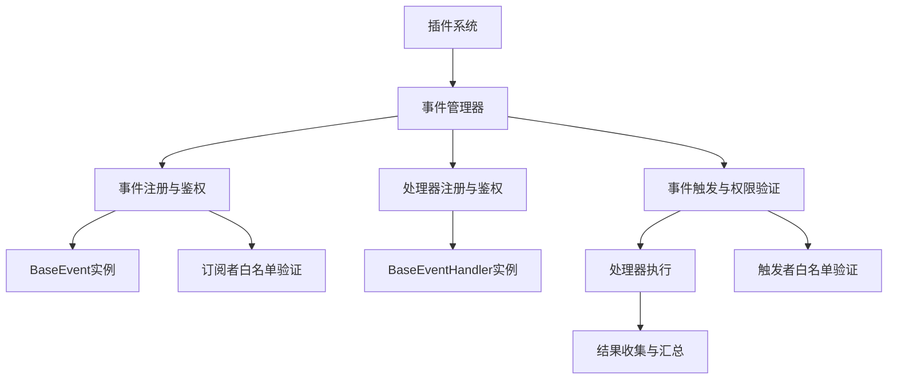

# 事件系统使用指南

## 概述

本项目的事件系统是一个基于插件架构的异步事件处理框架，允许插件通过事件驱动的方式进行通信和协作。事件系统采用发布-订阅模式，支持动态事件注册、处理器管理、权重排序、链式处理和细粒度鉴权机制。

## 核心概念

### 事件 (Event)
事件是系统中发生的特定动作或状态变化，可以被多个处理器监听和响应。每个事件可以配置订阅者和触发者的白名单权限。

### 事件处理器 (Event Handler)
事件处理器是响应特定事件的代码单元，可以订阅一个或多个事件。处理器支持权重排序和链式处理控制。

### 事件管理器 (Event Manager)
事件管理器是事件系统的核心，负责事件的注册、处理器的管理、权限验证以及事件的触发。

### 鉴权机制 (Authentication Mechanism)
系统提供双重鉴权机制：
- **订阅者白名单** (`allowed_subscribers`): 控制哪些处理器可以订阅事件
- **触发者白名单** (`allowed_triggers`): 控制哪些插件可以触发事件

## 系统架构



## 内置事件类型

系统预定义了以下事件类型：

| 事件名称 | 描述 | 触发时机 | 默认权限 |
|---------|------|----------|----------|
| `on_start` | 启动事件 | 系统启动时 | SYSTEM |
| `on_stop` | 停止事件 | 系统停止时 | SYSTEM |
| `on_message` | 消息事件 | 收到新消息时 | SYSTEM |
| `on_plan` | 计划事件 | 执行计划任务时 | SYSTEM |
| `post_llm` | 准备LLM事件 | 准备LLM时 | SYSTEM |
| `after_llm` | LLM后事件 | LLM响应后 | SYSTEM |
| `post_send` | 准备发送消息事件 | 准备发送消息时 | SYSTEM |
| `after_send` | 发送后事件 | 消息完全发送后 | SYSTEM |

## 快速开始

### 1. 创建事件处理器

继承 `BaseEventHandler` 基类并实现 `execute` 方法：

```python
from src.plugin_system import BaseEventHandler, EventType
from src.plugin_system.base.base_event import HandlerResult

class MyEventHandler(BaseEventHandler):
    handler_name = "my_handler"
    handler_description = "我的自定义事件处理器"
    weight = 10  # 权重，越大越先执行
    intercept_message = False  # 是否拦截消息
    init_subscribe = [EventType.ON_MESSAGE]  # 初始订阅的事件

    async def execute(self, params: dict) -> HandlerResult:
        """处理事件"""
        try:
            message = params.get("message")
            print(f"收到消息: {message}")
            
            # 业务逻辑处理
            # ...
            
            return HandlerResult(
                success=True,
                continue_process=True,  # 是否阻断后续流程
                message="处理成功",
                handler_name=self.handler_name
            )
        except Exception as e:
            return HandlerResult(
                success=False,
                continue_process=True,
                message=f"处理失败: {str(e)}",
                handler_name=self.handler_name
            )
```

### 2. 注册事件处理器

在插件中注册事件处理器：

```python
from src.plugin_system import BasePlugin, register_plugin

@register_plugin
class MyPlugin(BasePlugin):
    plugin_name = "my_plugin"
    
    def get_plugin_components(self):
        return [
            (MyEventHandler.get_handler_info(), MyEventHandler),
        ]
```

### 3. 触发事件

使用事件管理器触发事件，支持权限验证：

```python
from src.plugin_system.core.event_manager import event_manager

# 触发内置事件（需要SYSTEM权限）
await event_manager.trigger_event(EventType.ON_MESSAGE, permission_group="SYSTEM", message="Hello World")

# 触发自定义事件（需要相应权限）
await event_manager.trigger_event("custom_event", permission_group="my_plugin", data={"key": "value"})
```

## 鉴权机制详解

### 事件注册时的权限控制

注册事件时可以指定订阅者和触发者的白名单：

```python
# 注册事件，限制只有特定处理器可以订阅，特定插件可以触发
event_manager.register_event(
    "sensitive_event",
    allowed_subscribers=["audit_handler", "log_handler"],  # 订阅者白名单
    allowed_triggers=["security_plugin", "admin_plugin"]   # 触发者白名单
)
```

### 权限验证流程

1. **订阅权限验证**：处理器订阅事件时检查 `allowed_subscribers`
2. **触发权限验证**：插件触发事件时检查 `allowed_triggers`
3. **默认权限**：内置事件默认只允许 `SYSTEM` 权限组触发

### 权限组说明

- `SYSTEM`: 系统核心组件权限
- `插件名称`: 各个插件的权限标识
- 空字符串: 无权限组（无法触发有白名单的事件）

## 使用模式

### 接口式模式（内部编写handler，外部触发）

**适用场景**：插件提供事件处理能力，供其他组件调用

```python
# 服务提供者插件
class DataProcessorHandler(BaseEventHandler):
    handler_name = "data_processor"
    handler_description = "数据处理服务"
    weight = 10  # 权重，越大越先执行
    intercept_message = False  # 是否拦截消息
    init_subscribe = ["process_data_request"]
    
    async def execute(self, params: dict) -> HandlerResult:
        data = params.get("data")
        processed = self.process_data(data)
        return HandlerResult(True, True, processed)

# 服务消费者插件
async def use_data_service():
    result = await event_manager.trigger_event(
        "process_data_request", 
        permission_group="consumer_plugin",
        data={"input": "test"}
    )
    if result:
        processed_data = result.get_message_result()
```

### 通知式模式（外部编写handler，内部触发）

**适用场景**：插件内部发生事件，通知外部处理器

```python
# 事件生产者插件
class EventProducerPlugin(BasePlugin):
    def __init__(self):
        # 注册自定义事件，允许其他处理器订阅
        event_manager.register_event("custom_alert")
    
    async def detect_anomaly(self):
        if anomaly_detected:
            # 触发事件通知订阅者
            await event_manager.trigger_event(
                "custom_alert", 
                permission_group=self.plugin_name,
                anomaly_type="security",
                severity="high"
            )

# 事件消费者插件  
class AlertHandler(BaseEventHandler):
    handler_name = "alert_handler"
    init_subscribe = ["custom_alert"]
    
    async def execute(self, params: dict) -> HandlerResult:
        anomaly_type = params.get("anomaly_type")
        severity = params.get("severity")
        self.handle_alert(anomaly_type, severity)
        return HandlerResult(True, True, "Alert handled")
```

## 高级用法

### 动态订阅管理

```python
# 动态订阅处理器到事件
success = event_manager.subscribe_handler_to_event("handler_name", "event_name")

# 取消订阅
success = event_manager.unsubscribe_handler_from_event("handler_name", "event_name")

# 处理器自管理订阅
class DynamicHandler(BaseEventHandler):
    async def setup_subscriptions(self):
        self.subscribe("event1")
        self.subscribe("event2")
    
    async def cleanup(self):
        self.unsubscribe("event1")
```

### 参数传递机制

事件支持灵活的参数传递：

```python
# 触发事件时传递复杂参数
await event_manager.trigger_event(
    "complex_event",
    permission_group="my_plugin",
    user_info={"id": 123, "name": "test"},
    metadata={"timestamp": "2024-01-01", "source": "api"},
    nested_data={"level1": {"level2": "value"}}
)

# 处理器接收参数
async def execute(self, params: dict) -> HandlerResult:
    user_info = params.get("user_info", {})
    metadata = params.get("metadata", {})
    # 处理参数...
```

### 结果汇总与处理

事件触发后返回 `HandlerResultsCollection`，提供丰富的查询方法：

```python
results = await event_manager.trigger_event("my_event", permission_group="my_plugin", data=data)

# 获取处理摘要
summary = results.get_summary()
print(f"总处理器数: {summary['total_handlers']}")
print(f"成功数: {summary['success_count']}")
print(f"失败数: {summary['failure_count']}")
print(f"失败处理器: {summary['failed_handlers']}")

# 获取特定处理器结果
specific_result = results.get_handler_result("my_handler")
if specific_result and specific_result.success:
    print(f"处理器结果: {specific_result.message}")

# 检查处理链状态
if results.all_continue_process():
    print("所有处理器都允许继续处理")
else:
    print("有处理器中断了处理链")

# 获取所有消息结果
all_messages = results.get_message_result()
```

### 事件处理器权重

事件处理器支持权重机制，权重越高的处理器越先执行：

```python
class CriticalHandler(BaseEventHandler):
    weight = 100  # 高优先级，最先执行
    
class NormalHandler(BaseEventHandler):
    weight = 50   # 中等优先级
    
class BackgroundHandler(BaseEventHandler):
    weight = 1    # 低优先级，最后执行
```

### 事件链式处理

通过设置 `continue_process` 参数控制事件处理链：

```python
class FilterHandler(BaseEventHandler):
    async def execute(self, params):
        if should_filter(params):
            return HandlerResult(True, False, "已过滤")  # 终止后续处理
        return HandlerResult(True, True, "继续处理")
```

## 完整示例

### 示例1：消息监控插件（带权限控制）

```python
from src.plugin_system import BasePlugin, BaseEventHandler, register_plugin, EventType
from src.plugin_system.base.base_event import HandlerResult
from src.plugin_system.core.event_manager import event_manager

class MessageMonitorHandler(BaseEventHandler):
    handler_name = "message_monitor"
    handler_description = "监控所有消息并记录统计信息"
    weight = 5
    intercept_message = False
    init_subscribe = [EventType.ON_MESSAGE]

    def __init__(self):
        super().__init__()
        self.message_count = 0
        self.keyword_hits = 0

    async def execute(self, params):
        self.message_count += 1
        message = params.get("message", "")
        
        # 关键词检测
        if "重要" in str(message):
            self.keyword_hits += 1
            # 触发特殊事件（需要相应权限）
            await event_manager.trigger_event(
                "important_message_detected",
                permission_group=self.plugin_name,
                message=message,
                count=self.keyword_hits
            )
        
        print(f"消息 #{self.message_count}: {message[:50]}...")
        return HandlerResult(True, True, f"已处理消息 #{self.message_count}")

class ImportantMessageHandler(BaseEventHandler):
    handler_name = "important_handler"
    handler_description = "处理重要消息"
    weight = 10
    intercept_message = False
    init_subscribe = ["important_message_detected"]  # 动态订阅

    async def execute(self, params):
        message = params.get("message")
        count = params.get("count")
        print(f"⚠️ 检测到重要消息 #{count}: {message}")
        return HandlerResult(True, True, "重要消息已处理")

@register_plugin
class MessageMonitorPlugin(BasePlugin):
    plugin_name = "message_monitor"
    
    def __init__(self, *args, **kwargs):
        super().__init__(*args, **kwargs)
        # 注册自定义事件，设置权限控制
        event_manager.register_event(
            "important_message_detected",
            allowed_subscribers=["important_handler", "audit_handler"],  # 只允许特定处理器订阅
            allowed_triggers=["message_monitor"]  # 只允许本插件触发
        )

    def get_plugin_components(self):
        return [
            (MessageMonitorHandler.get_handler_info(), MessageMonitorHandler),
            (ImportantMessageHandler.get_handler_info(), ImportantMessageHandler),
        ]
```

### 示例2：系统监控插件（带结果汇总）

```python
import asyncio
import psutil
from datetime import datetime

class SystemMonitorHandler(BaseEventHandler):
    handler_name = "system_monitor"
    handler_description = "系统资源监控"
    weight = 1
    intercept_message = False
    init_subscribe = [EventType.ON_START]

    async def execute(self, params):
        # 启动监控任务
        asyncio.create_task(self._monitor_system())
        return HandlerResult(True, True, "系统监控已启动")
    
    async def _monitor_system(self):
        while True:
            # 每30秒检查一次系统状态
            cpu_percent = psutil.cpu_percent()
            memory = psutil.virtual_memory()
            
            if cpu_percent > 80 or memory.percent > 80:
                # 触发系统警报事件
                result = await event_manager.trigger_event(
                    "system_alert",
                    permission_group=self.plugin_name,
                    cpu_percent=cpu_percent,
                    memory_percent=memory.percent,
                    timestamp=datetime.now()
                )
                
                # 处理结果汇总
                if result:
                    summary = result.get_summary()
                    print(f"警报处理结果: {summary['success_count']}成功, {summary['failure_count']}失败")
            
            await asyncio.sleep(30)

class AlertHandler(BaseEventHandler):
    handler_name = "alert_handler"
    handler_description = "处理系统警报"
    weight = 20
    intercept_message = False
    init_subscribe = ["system_alert"]

    async def execute(self, params):
        cpu = params.get("cpu_percent")
        memory = params.get("memory_percent")
        timestamp = params.get("timestamp")
        print(f"🚨 系统警报({timestamp}): CPU {cpu}%, 内存 {memory}%")
        return HandlerResult(True, True, "警报已处理")

class AlertNotifierHandler(BaseEventHandler):
    handler_name = "alert_notifier"
    handler_description = "通知系统警报"
    weight = 15
    intercept_message = False
    init_subscribe = ["system_alert"]

    async def execute(self, params):
        cpu = params.get("cpu_percent")
        memory = params.get("memory_percent")
        # 发送通知...
        return HandlerResult(True, True, "通知已发送")

@register_plugin
class SystemMonitorPlugin(BasePlugin):
    plugin_name = "system_monitor"
    
    def __init__(self, *args, **kwargs):
        super().__init__(*args, **kwargs)
        # 注册系统警报事件
        event_manager.register_event("system_alert")
    
    def get_plugin_components(self):
        return [
            (SystemMonitorHandler.get_handler_info(), SystemMonitorHandler),
            (AlertHandler.get_handler_info(), AlertHandler),
            (AlertNotifierHandler.get_handler_info(), AlertNotifierHandler),
        ]
```

## 调试和监控

### 查看事件系统状态

```python
# 获取事件系统摘要
summary = event_manager.get_event_summary()
print(f"事件总数: {summary['total_events']}")
print(f"启用事件: {summary['enabled_events']}")
print(f"禁用事件: {summary['disabled_events']}")
print(f"处理器总数: {summary['total_handlers']}")
print(f"事件列表: {summary['event_names']}")
print(f"处理器列表: {summary['handler_names']}")
```

### 查看事件订阅情况

```python
# 查看特定事件的订阅者
subscribers = event_manager.get_event_subscribers(EventType.ON_MESSAGE)
for name, handler in subscribers.items():
    print(f"订阅者: {name}, 权重: {handler.weight}")

# 查看事件的权限设置
event = event_manager.get_event("important_message_detected")
if event:
    print(f"允许的订阅者: {event.allowed_subscribers}")
    print(f"允许的触发者: {event.allowed_triggers}")
```

### 事件执行监控

```python
# 监控事件执行性能
import time

async def monitored_trigger(event_name, **kwargs):
    start_time = time.time()
    results = await event_manager.trigger_event(event_name, **kwargs)
    end_time = time.time()
    
    if results:
        execution_time = end_time - start_time
        summary = results.get_summary()
        print(f"事件 {event_name} 执行时间: {execution_time:.3f}s")
        print(f"处理器执行统计: {summary}")
    
    return results
```