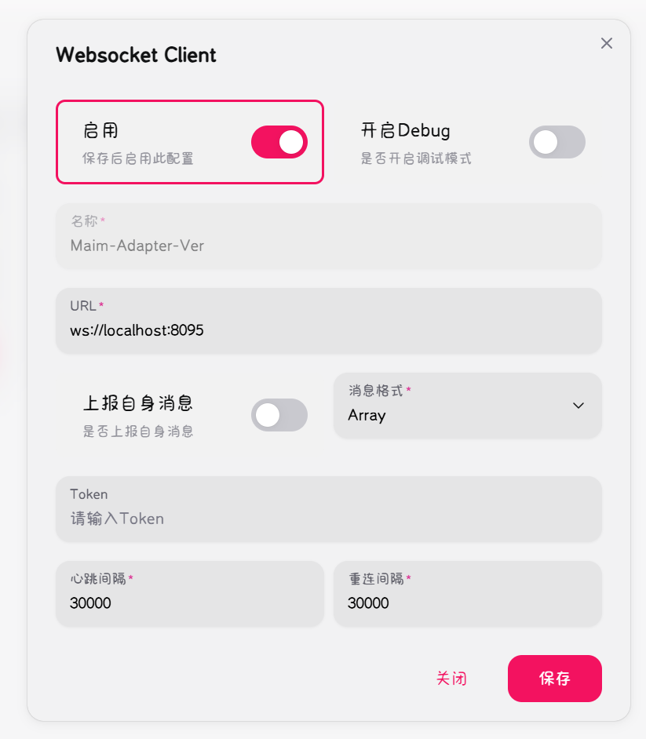

# MoFox_Bot Linux 部署指南

欢迎使用 MoFox_Bot！本指南将引导您完成在 Linux 环境下部署 MoFox_Bot 的全部过程。

## 1. 系统要求

- **操作系统**: 任何主流的 Linux 发行版 (如 Ubuntu, Debian, CentOS)
- **Python**: 版本 >= 3.10
- **Git**: 用于克隆项目仓库
- **uv**: 推荐的 Python 包管理器 (版本 >= 0.1.0)

## 2. 部署步骤

### 第一步：获取必要的文件

首先，创建一个用于存放 MoFox_Bot 相关文件的文件夹，并通过 `git` 克隆 MoFox_Bot 主程序和 Napcat 适配器。

```shell
cd ~
mkdir MoFox_Bot_Deployment
cd MoFox_Bot_Deployment
git clone https://github.com/MoFox-Studio/MoFox_Bot.git
git clone https://github.com/MoFox-Studio/Napcat-Adapter.git
```

### 第二步：环境配置

我们推荐使用 `uv` 来管理 Python 环境和依赖，因为它提供了更快的安装速度和更好的依赖管理体验。

**安装 uv:**

```shell
pip3 install uv --break-system-packages -i https://mirrors.huaweicloud.com/repository/pypi/simple/
echo 'export PATH="$HOME/.local/bin:$PATH"' >> ~/.bashrc
source ~/.bashrc
```

### 第三步：依赖安装

在 `MoFox_Bot_Deployment` 根目录下创建并激活虚拟环境，然后安装所有依赖。

- **使用 uv (推荐):**

  ```shell
  uv venv
  # 在 Linux 上激活虚拟环境
  source .venv/bin/activate
  uv pip install -r MoFox_Bot/requirements.txt -i https://mirrors.aliyun.com/pypi/simple --upgrade
  uv pip install -r Napcat-Adapter/requirements.txt -i https://mirrors.aliyun.com/pypi/simple --upgrade
  ```

- **备选方案：使用原生 venv 和 pip:**

  ```shell
  python3 -m venv .venv
  # 在 Linux 上激活虚拟环境
  source .venv/bin/activate
  pip install -r MoFox_Bot/requirements.txt -i https://mirrors.aliyun.com/pypi/simple --upgrade
  pip install -r Napcat-Adapter/requirements.txt -i https://mirrors.aliyun.com/pypi/simple --upgrade
  ```

### 第四步：配置 MoFox_Bot 和 Adapter

**1. MoFox_Bot 配置:**

 - **主配置文件**：在 `mmc` 文件夹中，将 `template/bot_config_template.toml` 复制到 `config/bot_config.toml`。
   ```shell
   cp mmc/template/bot_config_template.toml mmc/config/bot_config.toml
   ```
   打开这个新文件，至少需要填写你的**机器人QQ号**和**管理员QQ号**。

 - **模型配置文件 (关键步骤！)**
   - 请参照[模型配置快速上手](guides/quick_start_model_config.md)指南，创建并配置 `model_config.toml` 文件。

 > 对于新手，**完成以上步骤即可让机器人开口说话**！我们已经为您提供了一套完整的默认配置。
 > 如果你想了解更多关于模型的配置，或者想使用本地模型，请参考 [模型配置指南](model_configuration_guide.md)。

**2. Napcat-Adapter 配置:**

- 在 `Napcat-Adapter` 文件夹中，将 `template/template_config.toml` 复制到根目录下的config目录并改名为 `config.toml`。
  ```shell
  cp Napcat-Adapter/template/template_config.toml Napcat-Adapter/config/config.toml
  ```
- 打开 `config.toml` 文件，配置 `[napcat_server]` 和 `[maibot_server]` 字段。
  - `[napcat_server]` 的 `port` 应与 Napcat 设置的反向代理 URL 中的端口相同。
  - `[maibot_server]` 的 `port` 应与 MoFox_Bot 的 `bot_config.toml` 中设置的端口相同。

- **配置 Napcat 客户端**:
  - 在 Napcat 客户端的 `onebot v11` 设置中，添加一个反向 WebSocket 连接/websocket客户端。
  - URL 应填写为 `ws://127.0.0.1:端口号`，其中 `端口号` 必须与 `config.toml` 中 `[napcat_server]` 的 `port` 保持一致。
  - 

- **功能与白名单配置**:
  `Napcat-Adapter` 支持通过 `features.toml` 文件进行功能和权限的详细配置。
  - **创建配置文件**: 在 `Napcat-Adapter` 文件夹中，将 `template/features_template.toml` 复制到根目录下的config目录并改名为 `features.toml`。
    ```shell
    cp Napcat-Adapter/template/features_template.toml Napcat-Adapter/config/features.toml
    ```
  - **配置白名单**: 打开 `features.toml` 文件，根据其中的注释配置 `group_list` 和 `private_list` 等选项。
  > **注意**：`features.toml` 文件支持热重载，修改后无需重启 `Napcat-Adapter` 即可生效。

### 第五步：运行

**1. 启动 Napcat:**

请参考 [NapCatQQ 文档](https://napcat-qq.github.io/) 进行部署和启动。

**2. 启动 MoFox_Bot:**

进入 `mmc` 文件夹并启动程序。

- **使用 uv:**

  ```shell
  # 确保你已经激活了虚拟环境 (source .venv/bin/activate)
  cd MoFox_Bot
  uv run python bot.py
  ```

- **不使用 uv:**

  ```shell
  # 确保你已经激活了虚拟环境 (source .venv/bin/activate)
  cd MoFox_Bot
  python bot.py
  ```

**3. 启动 Napcat-Adapter:**

打开一个新的终端窗口，**确保激活了同一个虚拟环境**，然后进入 `Napcat-Adapter` 文件夹并启动程序。

- **使用 uv:**

  ```shell
  # 确保你已经激活了虚拟环境 (source .venv/bin/activate)
  cd Napcat-Adapter
  uv run python main.py
  ```

- **不使用 uv:**

  ```shell
  # 确保你已经激活了虚拟环境 (source .venv/bin/activate)
  cd Napcat-Adapter
  python main.py
  ```

至此，MoFox_Bot 已成功部署并运行。

## 3. 详细配置说明

### `bot_config.toml`

这是 MoFox_Bot 的主配置文件，包含了机器人昵称、主人QQ、命令前缀、数据库设置等。请根据文件内的注释和[MoFox-Bot 配置文件究极详细教程](bot_config_guide.md)进行详细配置。

### `model_config.toml`

此文件用于配置 AI 模型和 API 服务提供商。对于新手，**只需按照上面的步骤填写 API Key 即可**。如需深度定制，请参考 [模型配置进阶指南](model_configuration_guide.md)。

### 插件配置

每个插件都有独立的配置文件，位于 `mmc/config/plugins/` 目录下。插件的配置由其 `config_schema` 自动生成。详细信息请参考 [插件配置完整指南](../development/plugins/configuration-guide.md)。

## 4. 故障排除

- **依赖安装失败**:
  - 尝试更换 PyPI 镜像源。
  - 检查网络连接。
- **API 调用失败**:
  - 检查 `model_config.toml` 中的 API Key 和 `base_url` 是否正确。
- **无法连接到 Napcat**:
  - 检查 Napcat 是否正常运行。
  - 确认 `Napcat-Adapter` 的 `config.toml` 中 `[napcat_server]` 的 `port` 是否与 Napcat 设置的端口一致。
  - 确保 Napcat 客户端已正确配置反向 WebSocket，并且 URL 和端口无误。
  - 检查防火墙或安全软件是否阻止了 `Napcat-Adapter` 的网络连接。

如果遇到其他问题，请查看 `logs/` 目录下的日志文件以获取详细的错误信息。