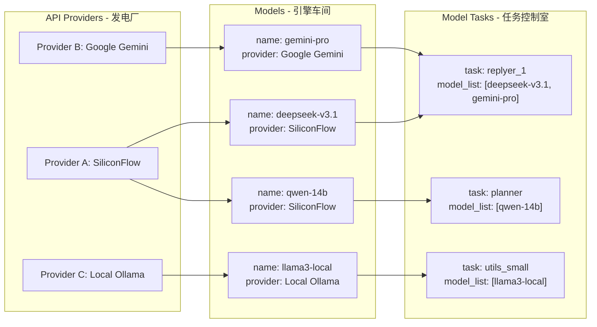

# 模型配置高级指南：从资源调度到智能策略

**欢迎，指挥官。**

这份指南不再是简单的“点餐教程”。我们将引导你从一位使用者，蜕变为一位运筹帷幄的 **AI 算力指挥官**。你将学习如何构建、管理并优化你的 AI Bot 的核心——`model_config.toml`，使其在性能、成本和稳定性之间达到完美的平衡。

准备好了吗？让我们开始搭建专属于你的“AI 算力调度中心”。


## 第一章：核心概念重构 - 搭建你的“AI算力调度中心”

忘掉“餐厅”和“菜单”吧。现在，请将 `model_config.toml` 想象成一个精密的 **AI 算力调度中心**。这个中心由三个层次分明的架构组成，它们协同工作，将原始的 AI 能力转化为 Bot 的智能行为。

### 1.1 三层核心架构

1.  **资源层 (API Providers)**：这是算力的源头，如同你的“**发电厂**”。无论是来自 DeepSeek、SiliconFlow 的云端服务，还是你自己部署的本地模型（如 Ollama），它们都为整个系统提供最基础的计算能力。

2.  **能力层 (Models)**：这是将原始算力转化为具体能力的“**引擎车间**”。在这里，你将来自不同“发电厂”的算力，封装成一个个具有明确标识、成本和特性的“AI 引擎”。例如，一个名为 `powerful-chat-engine` 的引擎，可能源自 DeepSeek 的最新模型。

3.  **应用层 (Model Tasks)**：这是指挥“AI 引擎”执行具体任务的“**任务控制室**”。Bot 的每一个行为，从简单的聊天回复 (`replyer`) 到复杂的决策规划 (`planner`)，都是一个独立的“任务”。你将在这里为每个任务指派最合适的“引擎”，甚至可以组建一支“引擎小队”来协同完成。

### 1.2 数据流向可视化

下面的图清晰地展示了这三层架构之间的依赖关系和数据流向：


*   **解读**：`replyer_1` 任务由 `deepseek-v3.1` 和 `gemini-pro` 两个引擎共同负责，它们分别来自 `SiliconFlow` 和 `Google Gemini` 这两个不同的发电厂。这种灵活的调度机制，正是高级配置的核心所在。


## 第二章：资源层 (API Providers) 深度解析 - 构筑稳定算力基石

资源层是整个系统的基石。一个稳定、可靠、多元化的资源层，是 Bot 能够持续提供高质量服务的前提。

### 2.1 多供应商策略：永不宕机的秘密

为什么要配置多个 Provider？

*   **风险对冲**：当某个服务商（如 DeepSeek）的 API 临时宕机或网络波动时，系统可以无缝切换到备用服务商（如 SiliconFlow），保证服务的连续性。
*   **成本优化**：不同的服务商对同一款模型可能有不同的定价。你可以通过多供应商配置，灵活选择当前性价比最高的渠道。
*   **能力互补**：某些特殊模型（如 Google 的 Gemini）只有特定的服务商提供。配置多个供应商可以让你博采众长。

### 2.2 关键参数详解

让我们以一个推荐的 **SiliconFlow** 配置为例，深入了解每个参数的含义和作用。SiliconFlow 聚合了众多优秀模型，是新手和专家的理想选择。

```toml
# --- SiliconFlow 配置 (推荐) ---
[[api_providers]]
name = "SiliconFlow"                       # 名字，方便在 Models 层引用
base_url = "https://api.siliconflow.cn/v1" # 官方API地址
# highlight-start
api_key = [
  "sk-key_1_xxxxxxxxxxxx",
  "sk-key_2_xxxxxxxxxxxx"
]                                          # 推荐使用多Key轮询，提高稳定性
# highlight-end
client_type = "openai"                     # 客户端类型，SiliconFlow 兼容OpenAI格式
# highlight-start
max_retry = 3                              # 最大重试次数，建议设置为3
timeout = 45                               # API请求超时（秒），网络不好可适当调高
retry_interval = 10                        # 重试间隔（秒）
# highlight-end
```

#### `api_key`：从“单兵作战”到“集团军”

*   **单个密钥**：`api_key = "sk-xxxxxxxx"`，简单直接。
*   **多个密钥（推荐）**：`api_key = ["sk-key1", "sk-key2"]`。Bot 会在每次请求时**自动轮流使用**这些密钥。这不仅能分摊单个 Key 的请求限额，还能在某个 Key 失效时自动切换到下一个，实现“**自动故障转移**”，极大提升了系统的健壮性。

#### `client_type`：选择正确的“通信协议”

*   `openai`：绝大多数兼容 OpenAI 接口的服务商（如 DeepSeek, SiliconFlow, Ollama）都使用此类型。
*   `aiohttp_gemini`：专门用于请求 Google Gemini 原生 API 的特殊客户端。
*   选择错误的客户端类型，会导致通信失败。

#### 韧性设计：`max_retry`, `timeout`, `retry_interval`

这三个参数共同构成了系统的“**韧性铁三角**”，是应对复杂网络环境的关键。

*   `max_retry`：当一次 API 请求因为网络问题或服务器临时错误而失败时，系统会自动重新尝试的次数。设置为 `3` 可以在不影响用户体验的前提下，有效对抗瞬时网络抖动。
*   `timeout`：发出请求后，等待服务器响应的最长时间。如果你的网络环境较差，或者调用的模型推理时间较长，可以适当增加此值（如 `60` 或 `90` 秒），避免因等待超时而导致的失败。
*   `retry_interval`：两次重试之间的等待时间。设置一个合理的间隔（如 `10` 秒）可以避免因过于频繁的重试而对 API 服务端造成冲击。

#### 安全与隐私：`enable_content_obfuscation`

*   这是一个高级安全功能，`enable_content_obfuscation = true`。启用后，系统会在向某些需要内容审核的 API 发送请求前，对文本进行轻微的、不影响语义的混淆，以降低被误判或审查的风险。`obfuscation_intensity`（混淆强度）可设置为 1 到 3。请注意，这并非万能，且可能会对模型理解产生微小影响，请谨慎使用。


## 第三章：能力层 (Models) 精细化调优 - 锻造专属AI引擎

在“引擎车间”，我们将来自“发电厂”的原始算力，打造成一个个性能各异、随时待命的“AI 引擎”。

### 3.1 命名与标识：`name` vs `model_identifier`

*   `model_identifier`：这是模型在服务商那里的“**官方型号**”，必须严格按照服务商的文档填写，例如 `"deepseek-ai/deepseek-v3.1"`。
*   `name`：这是你在自己的“调度中心”里为这个引擎取的“**内部代号**”，例如 `"deepseek-v3.1-chat"`。这个代号必须是唯一的，并且将在应用层 (Model Tasks) 中被频繁调用。一个好的命名习惯（如 `供应商-模型名-用途`）能极大提升配置文件的可读性。

### 3.2 成本控制单元：`price_in` & `price_out`

这两个参数是实现精细化成本管理的关键。

```toml
[[models]]
model_identifier = "deepseek-ai/deepseek-v3.1"
name = "deepseek-v3.1-chat"
api_provider = "SiliconFlow"
# highlight-start
price_in = 2.0                     # 输入价格（元 / M token）
price_out = 8.0                    # 输出价格（元 / M token）
# highlight-end
```

*   通过精确填写每个模型的调用成本，你可以利用 Bot 内置的统计功能，清晰地了解每一项任务、每一次对话的具体开销，为后续的成本优化提供数据支持。

### 3.3 模型行为微调

#### `force_stream_mode`：应对“急性子”模型

*   某些模型或服务商默认或只支持流式输出（打字机效果）。当遇到非流式请求就报错时，开启 `force_stream_mode = true` 可以强制系统以流式方式与该模型通信，确保兼容性。

#### `anti_truncation`：保证信息的完整性

*   在一些需要完整、结构化输出的场景（例如生成代码或长篇报告），模型的回答可能会因为达到最大长度限制而被“拦腰截断”。启用 `anti_truncation = true` 会激活一套特殊机制,如果侦测到被截断的话就会自动重试

#### `extra_params`：释放模型的隐藏潜能

*   这是一个高级定制功能，允许你向模型传递服务商 API 支持的、但 `model_config.toml` 中没有直接提供的额外参数。

    ```toml
    [[models]]
    model_identifier = "Qwen/Qwen3-8B"
    name = "qwen3-8b-fast"
    api_provider = "SiliconFlow"
    # highlight-start
    [models.extra_params]
    enable_thinking = false # 示例：关闭qwen3模型的“思考”过程，以换取更快的响应速度
    # highlight-end
    ```
*   要使用此功能，你必须仔细阅读并理解对应模型供应商的 API 文档，了解它们支持哪些独特的参数。


## 第四章：应用层 (Model Tasks) 策略与艺术 - 指挥你的AI军团

这里是“任务控制室”，是你作为指挥官智慧的最终体现。合理的任务分配策略，能让你的 Bot 在不同场景下都表现得像个专家。

### 4.1 任务角色分析

每个 `[model_task_config.*]` 都定义了一个独特的工作流。以下是几个核心任务的策略建议：

*   **`replyer_1` / `replyer_2` (主要/次要回复)**：这是 Bot 的“门面”。建议为 `replyer_1` 配置你最强大、最昂贵的模型（如 DeepSeek V3.1, Kimi K2），以保证核心聊天体验。`replyer_2` 可作为备用或用于风格切换。

*   **`planner` (决策模型)**：这是 Bot 的“大脑”。它负责理解用户意图，并决定下一步该做什么。此任务对模型的逻辑推理和指令遵循能力要求极高。推荐使用逻辑性强的模型，即使它不是最“能聊”的。

*   **`utils_small` (高频工具)**：用于处理一些内部的、高频次的简单文本处理任务。**强烈建议**为此任务配置一个速度快、成本极低的小模型（甚至是本地模型），能显著降低整体运营成本。

*   **`vlm` / `voice` / `embedding` (多模态与嵌入)**：这些是功能性任务，必须配置支持相应能力的专用模型。例如，`vlm` 任务需要配置像 `qwen-vl-max` 这样的视觉语言模型。

### 4.2 混合模型策略：因材施教

单一模型打天下的时代已经过去。现代化的配置思路是“因材施教”，为不同任务匹配最合适的模型。

```toml
# --- 混合模型策略示例 ---

# 核心聊天，使用最强模型
[model_task_config.replyer_1]
model_list = ["deepseek-v3.1-chat"]
temperature = 0.2

# 决策规划，使用逻辑强的模型
[model_task_config.planner]
model_list = ["kimi-k2-instruct"]
temperature = 0.3

# 高频工具，使用廉价快速的本地模型
[model_task_config.utils_small]
model_list = ["llama3-8b-local"]
temperature = 0.7

# 图像识别，使用专用VLM模型
[model_task_config.vlm]
model_list = ["qwen-vl-plus"]
```

### 4.3 负载均衡与故障转移

`model_list` 不仅可以填一个模型，更可以填多个，这是实现 **负载均衡** 和 **故障自动转移 (Failover)** 的核心。

```toml
[model_task_config.replyer_1]
# highlight-start
model_list = ["deepseek-v3.1-chat", "kimi-k2-instruct", "gemini-pro-backup"]
# highlight-end
```

*   **工作机制**：当 `replyer_1` 任务被触发时，系统会首先尝试使用列表中的第一个模型 (`deepseek-v3.1-chat`)。
    *   如果调用成功，流程结束。
    *   如果调用失败（例如 API Key 失效、服务商宕机），系统**会自动、无缝地**尝试列表中的第二个模型 (`kimi-k2-instruct`)。
    *   如果第二个依然失败，则继续尝试第三个，以此类推。
*   这套机制，是你构建一个 7x24 小时高可用 AI Bot 的终极武器。

### 4.4 并发与性能：`concurrency_count`

*   对于某些高频调用的任务（如 `emoji_vlm` 表情包识别），你可以设置 `concurrency_count = 2` 或更高。这将允许系统同时向该模型发起多个请求，在不阻塞主流程的情况下，并行处理任务，从而大幅提升在高并发场景下的响应速度。


## 第五章：高级策略与故障排查

### 5.1 实战策略

*   **本地与云端的混合部署**：将 Ollama 等本地模型作为 `utils_small`  的主力，可以实现近乎零成本处理大量基础任务，仅在需要高质量输出时才调用昂贵的云端 API。这是一种极致的成本优化策略。

*   **A/B 测试**：想知道两个模型哪个在特定任务上表现更好？在 `model_list` 中配置 `["model-A", "model-B"]`，并观察 Bot 的行为和日志。由于轮询机制，你可以近似实现对两个模型的 A/B 测试。

### 5.2 故障排查 (Troubleshooting)

配置一个复杂的系统，难免会遇到问题。学会诊断问题是成为指挥官的必修课。

*   **API Key 失效 / `401 Unauthorized`**：这是最常见的问题。请检查 `api_key` 是否填写正确、是否已过期、账户是否欠费。
*   **连接超时**：如果日志中频繁出现 `Timeout` 错误，请适当增加对应 `api_provider` 的 `timeout` 值。
*   **配置不生效**：修改 `model_config.toml` 后，需要**重启 Bot** 才能让新的配置生效。

> **需要更详细的帮助？**
> 我们为您整理了一份详尽的常见问题列表。当您遇到棘手的错误时，请首先查阅：
> *   **[模型配置常见问题解答 (FAQ)](./model_config_faq.md)**


**恭喜你，指挥官。**

你已经完成了从基础配置到高级策略的全部课程。现在，你手中的 `model_config.toml` 不再是一堆冰冷的参数，而是能够灵活调度全球 AI 算力、实现复杂智能策略的指挥中心。

去实践吧，不断调整、优化你的配置，打造出独一无二、真正属于你的 AI 伙伴。冒险，才刚刚开始。
