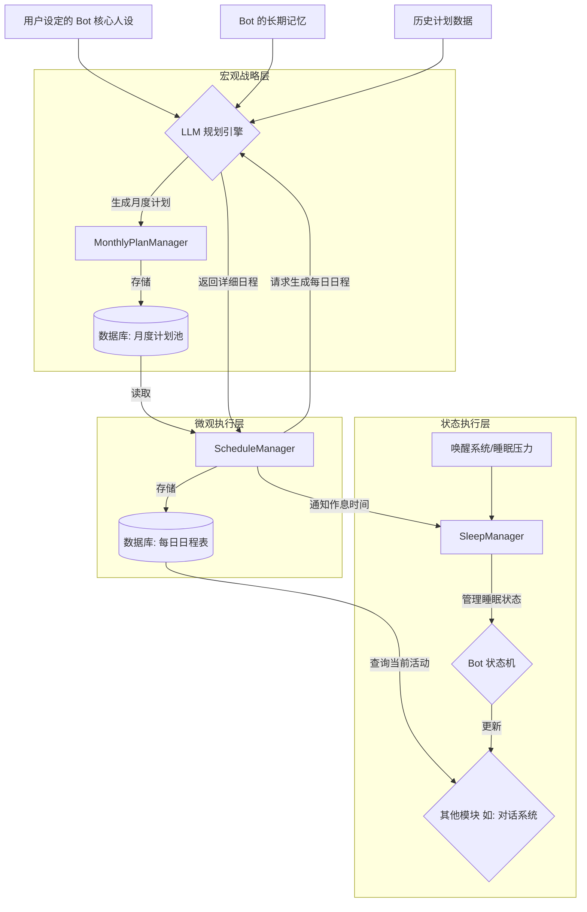

### MoFox-Bot 自主行为系统：日程、计划与睡眠

#### 1. 系统概述

自主行为系统是 MoFox-Bot 框架中的一项核心功能簇，旨在赋予 AI 智能体（Bot）超越被动式应答的能力，使其能够基于预设的人格（Persona）和长期目标，自主地规划并执行有时序性的活动。该系统主要由**日程与计划**及**睡眠**两大子系统构成，共同为 Bot 模拟出具有“生活节奏”和“目标追求”的复杂行为模式，从而为用户提供更加真实和沉浸的交互体验。

本系统的核心特性包括：

*   **长期目标驱动**：系统允许 Bot 建立以月为单位的长期目标，例如“学习一门新的编程语言”或“深入研究特定领域的知识”。这确保了 Bot 的所有行为都具有内在的逻辑一致性和长期连贯性。
*   **动态日程生成**：基于月度计划，系统会自动为 Bot 生成精细到小时的每日日程表。日程不仅包含与目标相关的任务（如学习、练习），也涵盖了符合其人设的日常活动（如休息、娱乐），从而模拟出完整的作息周期。
*   **情境感知交互**：系统提供了一个标准接口（`get_current_activity()`），供其他模块查询 Bot 当前正在进行的活动。这使得对话系统等模块能够根据 Bot 的“当前状态”作出符合情境的回应，极大地增强了交互的真实感。
*   **逼真的作息模拟**：通过与**睡眠系统**的深度集成，日程表中的“睡眠”时段将触发 Bot 进入真实的休眠状态。该状态由一个复杂的状态机管理，能够模拟入睡、失眠、被吵醒等多种情况，实现对生物作息的高度逼真模拟。

#### 2. 架构设计与核心组件

为实现上述功能，自主行为系统采用了一种双层规划架构，并将睡眠管理作为其不可或缺的执行环，确保了系统运行的逻辑性与真实感。



##### 2.1. 宏观战略层：月度计划管理器 (`MonthlyPlanManager`)

`MonthlyPlanManager` 扮演着 Bot“人生规划师”的角色，其核心职责是在每个月的月初，为 Bot 制定一份全新的、具有战略指导意义的月度计划。

*   **工作机制**：作为一个后台定时任务，`MonthlyPlanManager` 会在每月的第一天零点被自动唤醒。
*   **工作流程**：
    1.  **信息收集**：启动后，它会首先聚合 Bot 的核心人设、长期记忆以及过往的计划执行情况作为规划依据。
    2.  **与 LLM 交互**：随后，它将调用 `PlanManager`，将收集到的信息构建成一个结构化的提示（Prompt），请求大语言模型（LLM）生成符合 Bot 长期发展的月度目标。
    3.  **持久化存储**：LLM 返回的结构化目标将被解析并存储于数据库的“月度计划池”中，作为本月所有日常活动的战略起点。

##### 2.2. 微观执行层：每日日程管理器 (`ScheduleManager`)

`ScheduleManager` 相当于 Bot 的“每日管家”，负责将月度计划中的宏观目标分解为具体、可执行的每日日程表。

*   **工作机制**：该管理器同样以定时任务的形式，在每天零点启动。
*   **工作流程**：
    1.  **目标抽取**：从数据库中读取当月的计划池，抽取数个待办目标。
    2.  **生成日程**：围绕这些抽取的短期目标，再次请求 LLM 生成一份详细到小时的日程安排。
    3.  **状态更新与存储**：生成的日程表将被持久化到数据库，并作为当天 Bot 行为的唯一依据。
*   **核心接口与应用**：
    *   **`get_current_activity()`**：此接口允许系统的任何其他部分查询 Bot 在当前时间点的预定活动。
    *   **与 `SleepManager` 联动**：当日程进入“睡眠”时间，`ScheduleManager` 会立即通知 `SleepManager`，触发睡眠流程。

##### 2.3. 状态执行层：睡眠管理器 (`SleepManager`)

`SleepManager` 是实现 Bot 逼真作息的关键。它通过一个复杂的状态机来模拟角色的睡眠周期，并与计划系统及唤醒系统紧密协作。

*   **核心状态**：
    *   **AWAKE (清醒)**：角色的常规活动状态。
    *   **PREPARING_SLEEP (准备入睡)**：进入睡眠前的短暂过渡期，可配置发送晚安通知。
    *   **SLEEPING (正在睡觉)**：角色处于休眠中，不会响应大部分消息。
    *   **INSOMNIA (失眠)**：在睡眠期间可能由“睡眠压力”或随机概率触发的短暂清醒状态。
    *   **WOKEN_UP (被吵醒)**：当角色在睡眠中被强制唤醒时进入此状态，会尝试在延迟后重新入睡。

*   **配置选项**：您可以在 `bot_config.toml` 文件中对睡眠系统进行详细配置，以塑造不同的作息性格。

    ```toml
    [sleep_system]
    # 是否启用睡眠系统
    enable = true
    
    # 是否启用弹性睡眠 (根据“睡眠压力”延迟入睡)
    enable_flexible_sleep = true
    
    # 弹性睡眠压力阈值 (低于此值考虑熬夜)
    flexible_sleep_pressure_threshold = 60
    
    # 最大睡眠延迟分钟数
    max_sleep_delay_minutes = 120
    
    # 是否启用睡前通知
    enable_pre_sleep_notification = true
    
    # 失眠触发延迟分钟数范围 [min, max]
    insomnia_trigger_delay_minutes = [30, 90]
    
    # 失眠持续分钟数范围 [min, max]
    insomnia_duration_minutes = [10, 40]
    
    # 随机失眠概率
    random_insomnia_chance = 0.1
    
    # 被吵醒后尝试重新入睡的延迟分钟数
    re_sleep_delay_minutes = 10
    ```

*   **应用示例**：
    *   **规律作息**：关闭 `enable_flexible_sleep`。
    *   **喜欢熬夜**：调高 `flexible_sleep_pressure_threshold` 和 `max_sleep_delay_minutes`。

#### 3. 总结

MoFox-Bot 的自主行为系统通过“月度计划”、“每日日程”和“睡眠管理”的三层架构，将用户体验的深度与技术实现的专业性相结合，使 Bot 从一个简单的应答工具，转变为一个行为可预测、有成长轨迹、作息逼真的“虚拟生命”。通过启用并善用此系统，开发者可以创造出真正独一无二、能够与用户建立深度情感连接的 AI 伙伴。