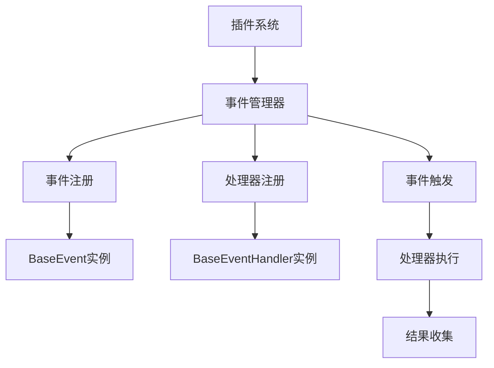

# 事件系统使用指南

## 概述

本项目的事件系统是一个基于插件架构的异步事件处理框架，允许插件通过事件驱动的方式进行通信和协作。事件系统采用发布-订阅模式，支持动态事件注册、处理器管理、权重排序和链式处理。

## 核心概念

### 事件 (Event)
事件是系统中发生的特定动作或状态变化，可以被多个处理器监听和响应。

### 事件处理器 (Event Handler)
事件处理器是响应特定事件的代码单元，可以订阅一个或多个事件。

### 事件管理器 (Event Manager)
事件管理器是事件系统的核心，负责事件的注册、处理器的管理以及事件的触发。

## 系统架构



## 内置事件类型

系统预定义了以下事件类型：

| 事件名称 | 描述 | 触发时机 |
|---------|------|----------|
| `on_start` | 启动事件 | 系统启动时 |
| `on_stop` | 停止事件 | 系统停止时 |
| `on_message` | 消息事件 | 收到新消息时 |
| `on_plan` | 计划事件 | 执行计划任务时 |
| `post_llm` | LLM后处理事件 | LLM处理完成后 |
| `after_llm` | LLM后事件 | LLM响应后 |
| `post_send` | 发送后处理事件 | 消息发送后 |
| `after_send` | 发送后事件 | 消息完全发送后 |

## 快速开始

### 1. 创建事件处理器

继承 `BaseEventHandler` 基类并实现 `execute` 方法：

```python
from src.plugin_system import BaseEventHandler, EventType
from src.plugin_system.base.base_event import HandlerResult

class MyEventHandler(BaseEventHandler):
    handler_name = "my_handler"
    handler_description = "我的自定义事件处理器"
    weight = 10  # 权重，越大越先执行
    intercept_message = False  # 是否拦截消息
    init_subscribe = [EventType.ON_MESSAGE]  # 初始订阅的事件

    async def execute(self, params: dict) -> HandlerResult:
        """处理事件"""
        try:
            message = params.get("message")
            print(f"收到消息: {message}")
            
            # 业务逻辑处理
            # ...
            
            return HandlerResult(
                success=True,
                continue_process=True,  # 是否继续让其他处理器处理
                message="处理成功",
                handler_name=self.handler_name
            )
        except Exception as e:
            return HandlerResult(
                success=False,
                continue_process=True,
                message=f"处理失败: {str(e)}",
                handler_name=self.handler_name
            )
```

### 2. 注册事件处理器

在插件中注册事件处理器：

```python
from src.plugin_system import BasePlugin, register_plugin

@register_plugin
class MyPlugin(BasePlugin):
    plugin_name = "my_plugin"
    
    def get_plugin_components(self):
        return [
            (MyEventHandler.get_handler_info(), MyEventHandler),
        ]
```

### 3. 触发事件

使用事件管理器触发事件：

```python
from src.plugin_system.core.event_manager import event_manager

# 触发内置事件
await event_manager.trigger_event(EventType.ON_MESSAGE, message="Hello World")

# 触发自定义事件
await event_manager.trigger_event("custom_event", data={"key": "value"})
```

## 高级用法

### 动态事件管理

#### 注册自定义事件
```python
# 注册新事件
event_manager.register_event("my_custom_event")

# 检查事件是否存在
event = event_manager.get_event("my_custom_event")
```

#### 动态订阅管理
```python
# 动态订阅处理器到事件
event_manager.subscribe_handler_to_event("handler_name", "event_name")

# 取消订阅
event_manager.unsubscribe_handler_from_event("handler_name", "event_name")
```

#### 启用/禁用事件
```python
# 禁用事件
event_manager.disable_event("event_name")

# 启用事件
event_manager.enable_event("event_name")
```

### 事件处理器权重

事件处理器支持权重机制，权重越高的处理器越先执行：

```python
class HighPriorityHandler(BaseEventHandler):
    weight = 100  # 高优先级
    
class LowPriorityHandler(BaseEventHandler):
    weight = 1    # 低优先级
```

### 事件链式处理

通过设置 `continue_process` 参数控制事件处理链：

```python
class FilterHandler(BaseEventHandler):
    async def execute(self, params):
        if should_filter(params):
            return HandlerResult(True, False, "已过滤")  # 终止后续处理
        return HandlerResult(True, True, "继续处理")
```

### 事件结果处理

事件触发后返回 `HandlerResultsCollection`，可以获取详细的处理结果：

```python
results = await event_manager.trigger_event("my_event", data=data)

# 获取处理摘要
summary = results.get_summary()
print(f"总处理器数: {summary['total_handlers']}")
print(f"成功数: {summary['success_count']}")
print(f"失败处理器: {summary['failed_handlers']}")

# 获取特定处理器结果
result = results.get_handler_result("my_handler")
if result and result.success:
    print("处理器执行成功")
```

## 完整示例

### 示例1：消息监控插件

```python
from src.plugin_system import BasePlugin, BaseEventHandler, register_plugin, EventType
from src.plugin_system.base.base_event import HandlerResult
from src.plugin_system.core.event_manager import event_manager

class MessageMonitorHandler(BaseEventHandler):
    handler_name = "message_monitor"
    handler_description = "监控所有消息并记录统计信息"
    weight = 5
    intercept_message = False
    init_subscribe = [EventType.ON_MESSAGE]

    def __init__(self):
        super().__init__()
        self.message_count = 0
        self.keyword_hits = 0

    async def execute(self, params):
        self.message_count += 1
        message = params.get("message", "")
        
        # 关键词检测
        if "重要" in str(message):
            self.keyword_hits += 1
            # 触发特殊事件
            await event_manager.trigger_event(
                "important_message_detected",
                message=message,
                count=self.keyword_hits
            )
        
        print(f"消息 #{self.message_count}: {message[:50]}...")
        return HandlerResult(True, True, f"已处理消息 #{self.message_count}")

class ImportantMessageHandler(BaseEventHandler):
    handler_name = "important_handler"
    handler_description = "处理重要消息"
    weight = 10
    intercept_message = False
    init_subscribe = ["important_message_detected"]  # 动态订阅

    async def execute(self, params):
        message = params.get("message")
        count = params.get("count")
        print(f"⚠️ 检测到重要消息 #{count}: {message}")
        return HandlerResult(True, True, "重要消息已处理")

@register_plugin
class MessageMonitorPlugin(BasePlugin):
    plugin_name = "message_monitor"
    
    def __init__(self, *args, **kwargs):
        super().__init__(*args, **kwargs)
        # 注册自定义事件
        event_manager.register_event("important_message_detected")

    def get_plugin_components(self):
        return [
            (MessageMonitorHandler.get_handler_info(), MessageMonitorHandler),
            (ImportantMessageHandler.get_handler_info(), ImportantMessageHandler),
        ]
    
```

### 示例2：系统监控插件

```python
import asyncio
import psutil
from datetime import datetime

class SystemMonitorHandler(BaseEventHandler):
    handler_name = "system_monitor"
    handler_description = "系统资源监控"
    weight = 1
    intercept_message = False
    init_subscribe = [EventType.ON_START]

    async def execute(self, params):
        # 启动监控任务
        asyncio.create_task(self._monitor_system())
        return HandlerResult(True, True, "系统监控已启动")
    
    async def _monitor_system(self):
        while True:
            # 每30秒检查一次系统状态
            cpu_percent = psutil.cpu_percent()
            memory = psutil.virtual_memory()
            
            if cpu_percent > 80 or memory.percent > 80:
                await event_manager.trigger_event(
                    "system_alert",
                    cpu_percent=cpu_percent,
                    memory_percent=memory.percent,
                    timestamp=datetime.now()
                )
            
            await asyncio.sleep(30)

class AlertHandler(BaseEventHandler):
    handler_name = "alert_handler"
    handler_description = "处理系统警报"
    weight = 20
    intercept_message = False
    init_subscribe = ["system_alert"]

    async def execute(self, params):
        cpu = params.get("cpu_percent")
        memory = params.get("memory_percent")
        print(f"🚨 系统警报: CPU {cpu}%, 内存 {memory}%")
        return HandlerResult(True, True, "警报已处理")

@register_plugin
class SystemMonitorPlugin(BasePlugin):
    plugin_name = "system_monitor"
    
    def __init__(self, *args, **kwargs):
        super().__init__(*args, **kwargs)
        event_manager.register_event("system_alert")
    
    def get_plugin_components(self):
        return [
            (SystemMonitorHandler.get_handler_info(), SystemMonitorHandler),
            (AlertHandler.get_handler_info(), AlertHandler),
        ]
    
```

## 调试和监控

### 查看事件系统状态
```python
# 获取事件系统摘要
summary = event_manager.get_event_summary()
print(f"事件总数: {summary['total_events']}")
print(f"处理器总数: {summary['total_handlers']}")
print(f"事件列表: {summary['event_names']}")
```

### 查看事件订阅情况
```python
# 查看特定事件的订阅者
subscribers = event_manager.get_event_subscribers(EventType.ON_MESSAGE)
for name, handler in subscribers.items():
    print(f"订阅者: {name}, 权重: {handler.weight}")
```

## 最佳实践

1. **权重设置**：合理设置处理器权重，避免权重冲突
2. **错误处理**：始终在处理器中添加异常处理
3. **性能考虑**：避免在处理器中执行耗时操作，可使用异步任务
4. **事件命名**：使用清晰的事件名称，避免与内置事件冲突
5. **资源清理**：在插件卸载时取消订阅相关事件
6. **日志记录**：适当记录处理日志，便于调试和监控

## 常见问题

### Q: 如何处理事件的执行顺序？
A: 通过设置处理器的 `weight` 属性来控制执行顺序，权重越高越先执行。

### Q: 如何阻止后续处理器执行？
A: 在处理器返回 `HandlerResult` 时设置 `continue_process=False`。

### Q: 如何动态注册事件？
A: 使用 `event_manager.register_event("event_name")` 方法注册新事件。

### Q: 如何获取事件处理结果？
A: 事件触发后会返回 `HandlerResultsCollection`，可以获取详细的处理结果和摘要信息。

### Q: 如何处理异步事件？
A: 所有事件处理器都是异步的，可以在 `execute` 方法中使用 `await` 进行异步操作。